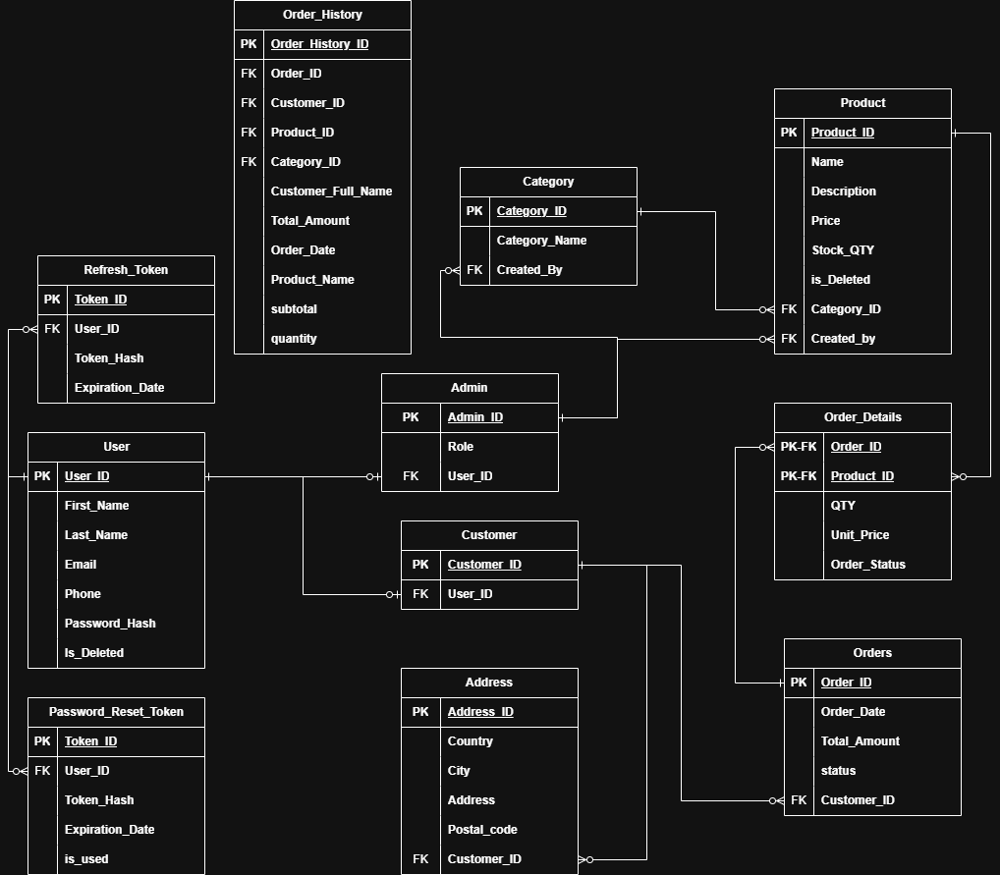
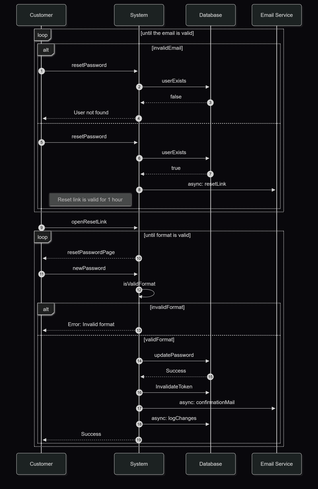
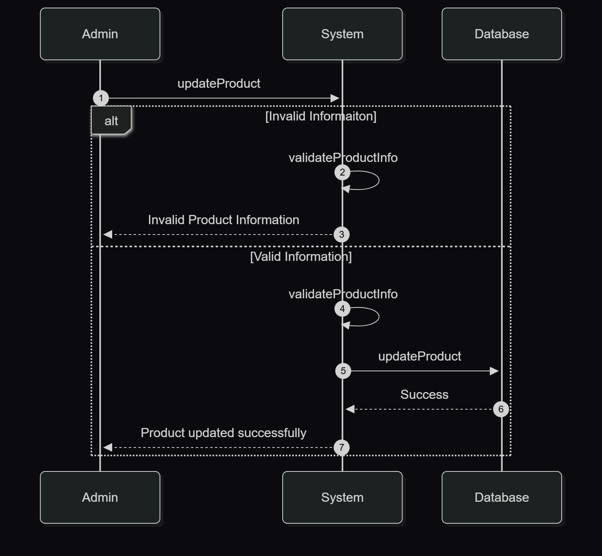

# E-Commerce-System-Analysis-Document--SAD

This repository contains the **functional analysis**, **UML diagrams**, and **high - level technical documentation** for an E-Commerce web application.

The goal of this project is to build the system **incrementally**, using a  
_User Story → Requirements → Flowchart → Sequence Diagram → Implementation_ approach.

This repo **does NOT contain backend or frontend code**.  
It focuses exclusively on documenting how the system should work.

---

## 📌 Project Purpose

> This project is revesion for the system analysis part in a mentorship program.

### This project exists to:

- Break down each user story into **clear technical workflows**.
- Produce **flowcharts, sequence diagrams, pseudocode**.

> It acts as the **source of truth** for:

- System behavior
- Business logic
- Technical flows
- Developer guidelines

---

## Vision

Becoming the leading e-commerce platform the delivers exceptional shopping experience through innovative technology, personalized service and reliable delivery while empowering business with powerful tools for growth.
Providing customers with easy access to quality products while enabling business to efficiently manage their operation and scale their growth.

---

## User Roles

- Visitor
- Registered Customer
- Administrator

---

## Database Schema



## Schema Overview

- **User**: Base entity for all platform users (Admins & Customers).
- **Admin**: Extends User, includes a `Role`. Responsible for product/category management.
- **Customer**: Extends User, places orders.
- **Address**: Stores multiple addresses for each customer (billing/shipping).
- **Product**: Stores product info, linked to Category and Admin (creator).
- **Category**: Lookup table for product categories.
- **Orders**: Customer orders, containing total amount, date, and status.
- **Order_Details**: Assotiative entity between Orders and Products (Qty + Unit Price), order status is denormalized for fast lookup before product deletion.
- **Order_History**: **Denormalized table** storing full order summaries to reduce joins between tables.
- **Refresh_Tokens**: Stores refresh tokens for authenticated users, used for session management and token renewal.
- **Password_Reset_Token**: Stores password reset tokens.

## Denormalization Note

The `Order_History` table is intentionally **denormalized** to optimize read performance and simplify reporting.  
It stores:

- Customer full name
- Total amount
- Order date
- Products as **JSONB**

This reduces JOIN operations and speeds up historical order retrieval.

---

<div align=center>

## Flowcharts & Sequence Diagrams & pseudooce

</div>

### [US-001 User Registration](./US-001-User-Registration/)

#### Flowchart

<div align=center>


</div>

#### Sequence Diagram

<div align=center>


</div>

#### Pseudocode

```text
function  manageUserRegistration(userInfo){
    if(!isValidInputs(userInfo))
        return "Invalid data!";

    saveToDatabase(userInfo);
    @async mailUser(userInfo.email);
}
function isValidInputs(userInfo){
    if(userInof.firstName.isEmpty())
        return false;

    if(userInof.lastName.isEmpty())
        return false;

    if(!isValidEmailFormat(userInof.email))
        return false;

    if(!isValidPassword(userInfo.password))
        return falsel;

    return true;


}

```

---

### [US-002 User Login](./US-002-User-login/)

#### Flowchart

<div align=center>


</div>

#### Sequence Diagram

<div align=center>


</div>

#### Pseudocode

```text
function string authenticateCustomer(custCredentials){
    Customer customer = findCustomer(custCredentials); // DB call

    if customer is null // means not found (invalid email or password)
        return "Invalid Email or Password";

    if customer choosed Remember Me option
        return session valid for 30 days

    return session valid for 24 hours;
}
```

---

### [US-003 Password Recovery](./US-003-Password-Recovery/)

#### Flowchart

<div align=center>


</div>

#### Sequence Diagram

<div align=center>



</div>

#### Pseudocode

```text
function getPasswordResetLink(userEmail){
    if(!userExists(userEmail))
        return "User not found";

    Token token=new Token();
    token.expirationDate(currentTime + 1);

    saveResetPasswordToken(token, email); // DB call
    @async sendResetPasswordLink(userEmail, token); // we should have a background worker to check if the email is sent successfully.

    return "Email sent please check your inbox";
}

function resetPassword(newPassword, userEmail, token){

    if (isTokenExpired(token))
        return "expired token";

    if(!isValidPasswordFormat(newPassword))
        return "Invalid password format";


    updatePassword(userEmail, newPassword); // DB call it also invalidates the old password / the password should be hashed using SHA256 algorithm.
    invalidateToken(token);

   logPasswordChangeEevent(userEmail);
   @async sendConfirmationMail(userEmail); // will be checked by the background worker.

    return "Password changed successfully";
}

```

---

### [US-004 Search Products](./US-004-Search-Products/)

#### Flowchart

<div align=center>


</div>

#### Sequence Diagram

<div align=center>


</div>

#### Pseudocode

```text
function searchProducts(keywords){
    if(keywords.length()<2)
        return;

    list<Products> products=findRelevantProducts(keywords) // DB call

    if(products==null)
        return "No results found";

    return products;

}
```

---

### [US-005 Manage Products](./US-005-Manage-Products/)

### [US-005.1 Create New Product](./US-005-Manage-Products/Create-New-Product/)

#### Flowchart

<div align=center>


</div>

#### Sequence Diagram

<div align=center>


</div>

#### Pseudocode

```text
function createNewProduct(Product:product){
    if(product.price < 0)
        return "Price cannot be less than zero";

    if(product.quantity < 0)
    return "Quantity cannot be less than zero";

    if(isValidImage(product.image))
        return "Invalid image";

    addNewProduct(product); // DB Call where we also validate product's info

    return "Product added successfully";
}

function isValidImage(image){
    if(image.size > 5MP)
        return false;

    if(image.extention != PNG or JPG)
        return false;

    return true;
}
```

---

### [US-005.2 Edit Product](./US-005-Manage-Products/Edit-Product/)

#### Flowchart

<div align=center>


</div>

#### Sequence Diagram

<div align=center>



</div>

#### Pseudocode

```text
function editProduct(Product:product){
    if(product.price < 0)
        return "Price cannot be less than zero";

    if(product.quantity < 0)
    return "Quantity cannot be less than zero";

    if(isValidImage(product.image))
        return "Invalid image";

    editProduct(product); // DB Call where we also validate product's info

    return "Product udpated successfully";
}

function isValidImage(image){
    if(image.size > 5MP)
        return false;

    if(image.extention != PNG or JPG)
        return false;

    return true;
}
```

---

### [US-005.3 Delete Product](./US-005-Manage-Products/Delete-Product/)

#### Flowchart

<div align=center>


</div>

#### Sequence Diagram

<div align=center>


</div>

#### Pseudocode

```text
function deletePrduct(productId){
    if(!deactivateProduct(productId)) // DB transaction checks if product in pending order before deactivating
        return "This product cannot be deleted";

    return "Product deleted successfully"
}

```

---

## **Contact**

For questions or feedback:

- GitHub: [@AbdallaSamirKhalifa](https://github.com/AbdallaSamirKhalifa)
- Email: abdallasamirkhalifa@gmail.com
