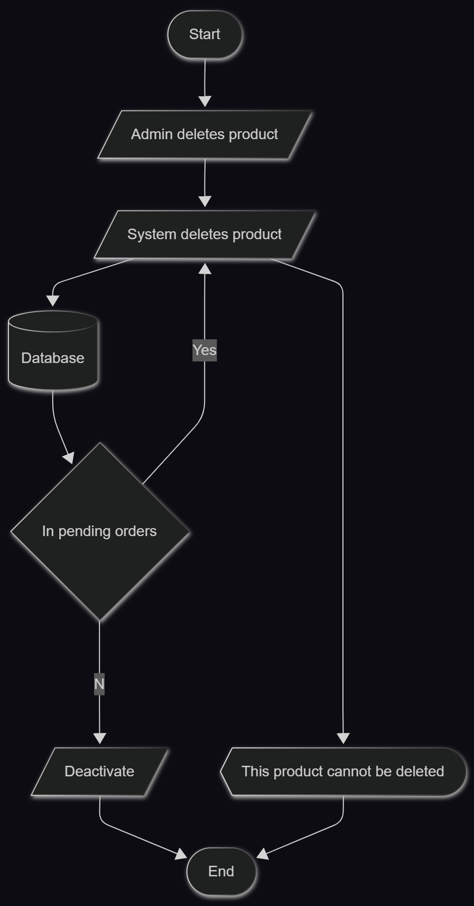
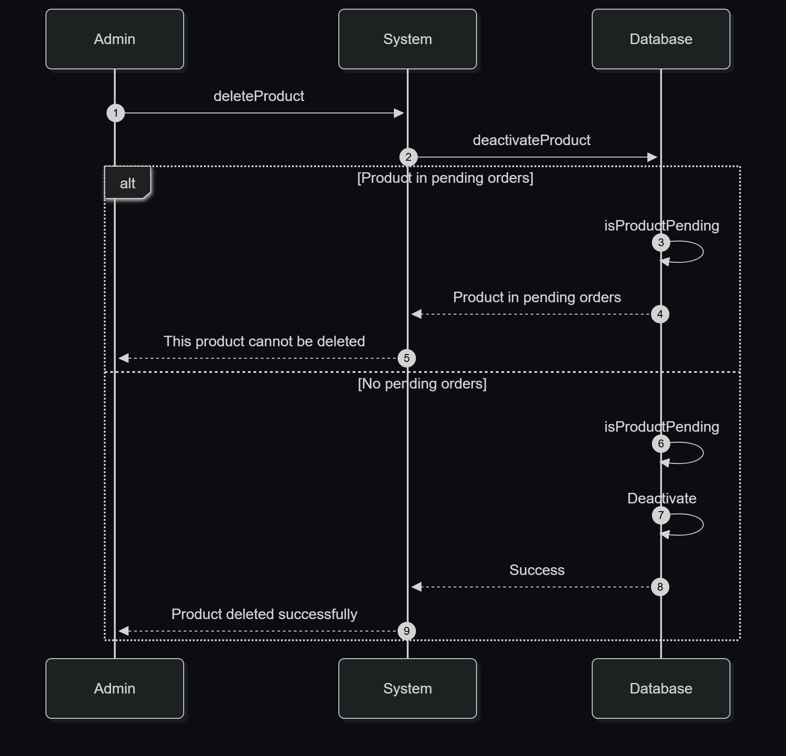

<h1 align=center>

US-009.3-Diagrams & Pseudocode

</h1>

## Flowchart

### High-level visual representation of the process:

<div align=center>



 </div>

## Sequence Diagram

### Illustrates the step-by-step interaction between actors and the system:

<div align=center>



 </div>

## Pseudocode

```text
function deletePrduct(productId){
    if(!deactivateProduct(productId)) // DB transaction checks if product in pending order before deactivating
        return "This product cannot be deleted";

    return "Product deleted successfully"
}

```
